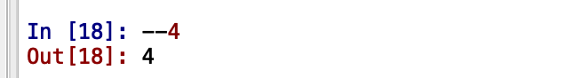
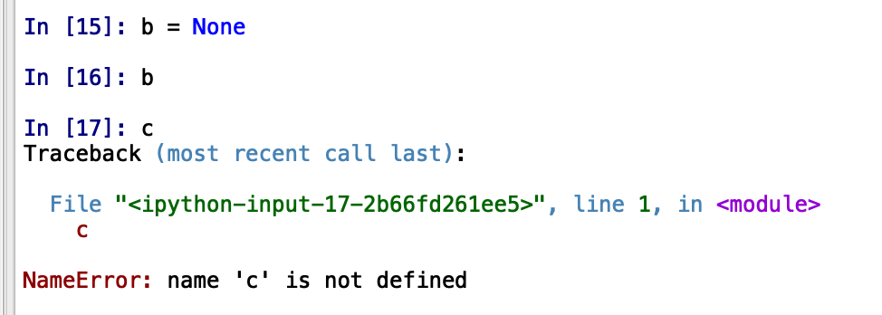
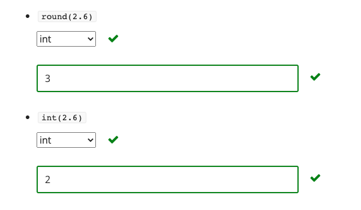
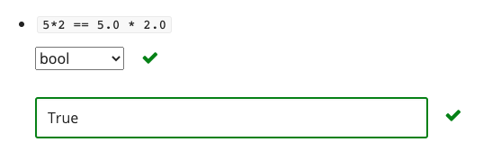
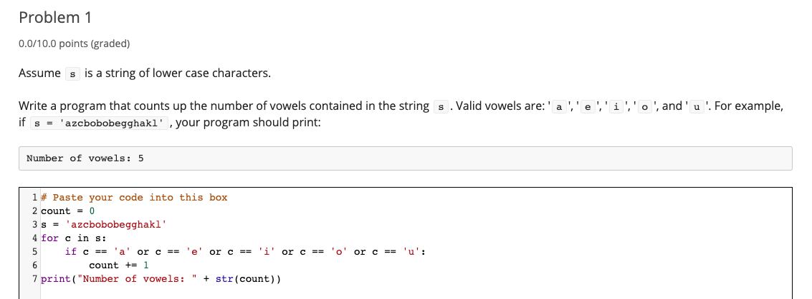
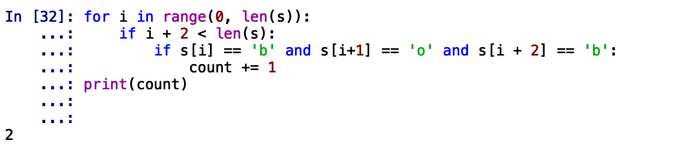
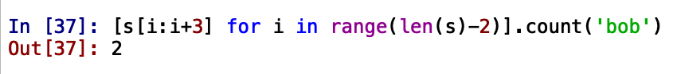

# Lec1

## Computer programming Basics

**A stored program** computer is designed to run any computation, by interpreting a sequence of program instructions that are read into it.


**A fixed program computer** is designed to compute precisely one computation, such as a square root, or the trajectory of a missile.


**A program counter** points the computer to the next instruction to execute in the program.


**6 primitive operations by Turing** : left, right, scan, read, stop

## Python Basics


* Objects

  * All objects are stored in heap
  * Scalars
    * int
    * float
    * bool - True / False
    * NoneType - None
  * Non-scalars
    * String

* Operators

  * ```text
    level 1
    ** power
    
    level 2
    *
    / - result is float
    // - int division, quotient
    % - remainder 
    
    注意，python的// 和 % 是取模，商向负无穷方向舍入(floor()函数)
     eg. -7 // 4 = -2， -7 % 4 = 1
    
    level 3
    + 
    -
    ```

* Assignment : `=`

* Comparison

  ```
  1. values
  > / >=
  < / <= 
  ==
  !=
  
  2. boolean 
  
  not
  and 
  or
  ```

* Conditional

```
if else
if elif
if elif else
```

## Exercises









# Problem Set 1

## Problem1



## Problem 2





## Problem 3

Assume `s` is a string of lower case characters.

Write a program that prints the longest substring of `s` in which the letters occur in alphabetical order. For example, if `s = 'azcbobobegghakl'`, then your program should print

```
Longest substring in alphabetical order is: beggh
```

In the case of ties, print the first substring. For example, if `s = 'abcbcd'`, then your program should print

```
Longest substring in alphabetical order is: abc
```

```python
#Sliding window
# if s = '' or NoneType, then result is ''
s = 'abcbcd'
left = 0
right = 0
maxLen = 1
maxSub = s[0]
while right < len(s):
  #expand right
  right += 1
  if right == len(s): 
      break
  if s[right] > s[right - 1]:
    if maxLen < right - left + 1:
      maxLen = right - left + 1
      maxSub = s[left : right + 1]
  else:
    #shrink left
  	left = right
print(maxSub)
```

