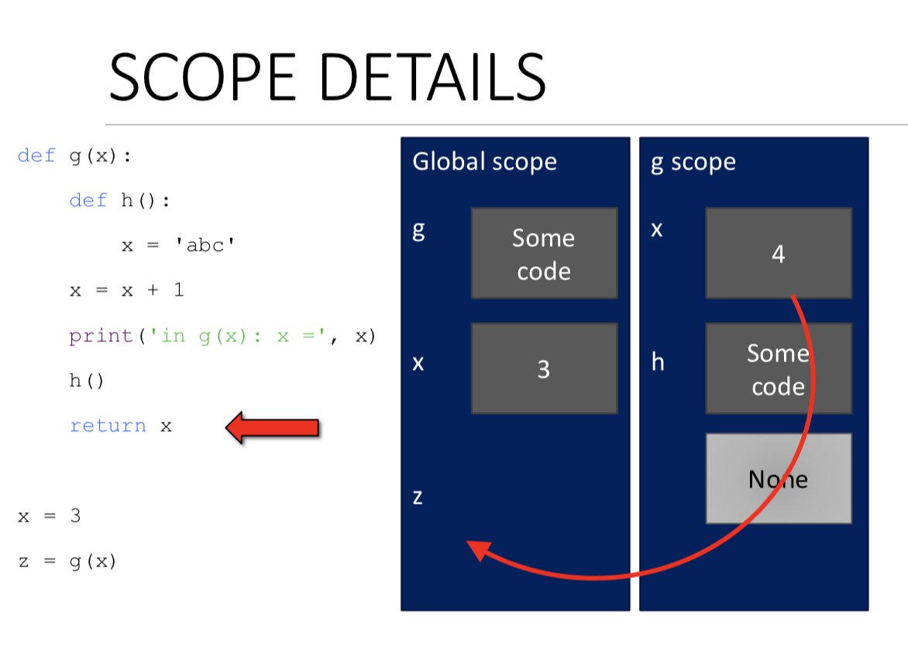
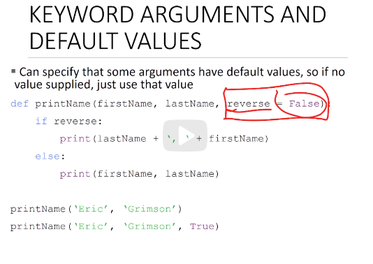
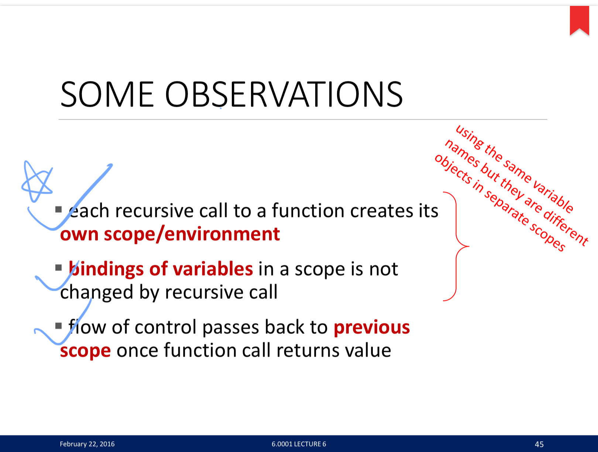
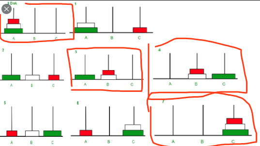

# Lec4_functions

## Functions

* Reusable piece of codes; only run when you call them

* Definition

  ```python
  def function_name(param1, param2):
    return some_result
  ```

* **Variable scope**

  * In the below example, x is not modified by h. (h returns None)

  

* **Keyword Argument and Default values**

  * Use arg_name = value in function () to give default value

    

* **return vs print**

  * return -> 返回
  * print -> 打印
  * No return -> returns `None`


## Recursion

* Iteration vs recursion

  * Iteration
    * with `while` and/or `for` loop
    * capture computation in a set of state variables that update on each iteration 

* Recursion: **<u>decrease and conquer</u>**

  * A function that calls itself
  * Consist of 
    * Base case
    * Recursive Rules

  

### Examples

* Tower of Hanoi

```python
def tower(n, fr, to, spare):
  if n == 1:
    printMove(fr, to)
  else: 
    tower(n-1, fr, spare, to)#move n - 1 disk from from to spare
    tower(1, fr, to, spare)# move last 1 disk from from to to
    tower(n-1, spare, to, fr)# move n - 1 disk from spare to to
```



* Fibonacci

  ```python
  f(n) = f(n - 1) + f (n - 2)
  ```

  

* Is palindrome

## Modules 

* Module: a Python file that has a `.py` extension to it that's a collection of Python

```python
import document1_name as doc1
from document2_name import function1_name, function2_name
```

## Files

```python
nameHandle  = open('file_path', 'w')
for line in nameHandle:
 # do something
nameHandle.close()
```

