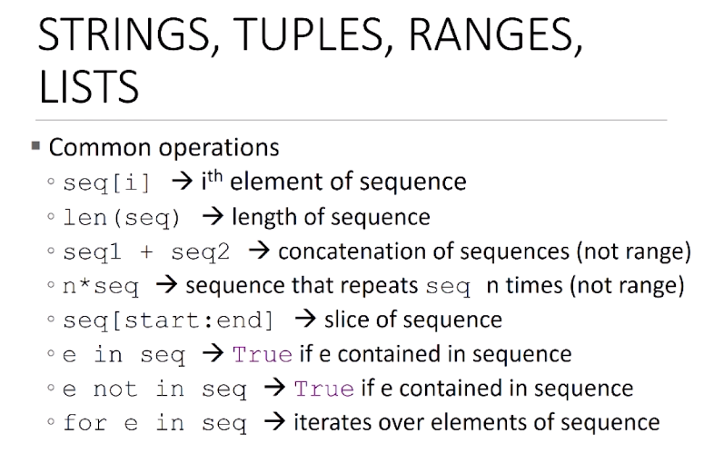
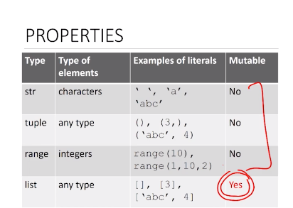
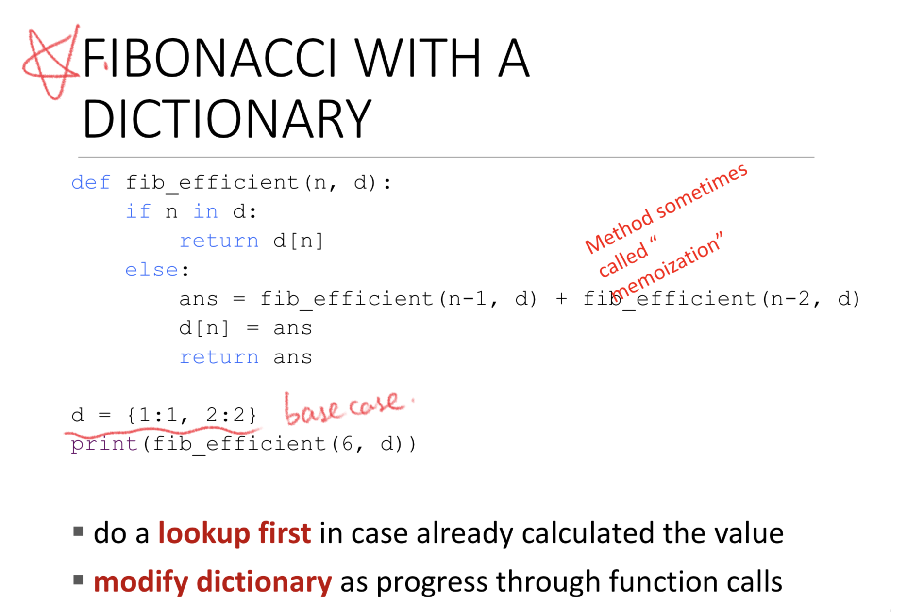

# Lec6_function_as_object_dict

## higher order programming

* use functions as args

```python
# apply f to each element in L
def applyToEach(L, f):
  for i in range(len(L)):
    L[i] = f(L[i]) 
# apply each f in L to x
def applyFunctions(L, x): #L = [abs, int, fact]
  for func in L:
    print(f(x))

# map  
for val in map(abs, [-1, 2, 3, -4]):
  print(val) # 1, 2, 3, 4

for val in map(min, [1, 28, 36], [2, 57, 9]):
  print(val) # [1, 28, 9]
 
```

## Common Operation of string/tuple/range/list

* `[i]`
* `len()`
* `+`
* `*`
* `[:]`
* `in / not in`
* `for e in seq`



 

## Dictionary

* `{}`, key-value pair
* `grades = {'Ana': 'B'}`
  * `grades['Ana']` -> `'B'`
  * `'John' in grades`
  * Add `grades['Katy'] = 'A'`
  * Delete `del(grades['Katy'])`
  * Iterate  `grades.keys()` / `grades.values()`
* Key
  * Better not float
  * Fixed type
* Example : fibonacci with memorization



# Global variable

* `global`

