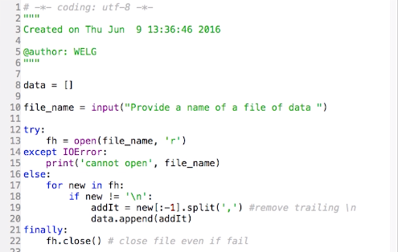
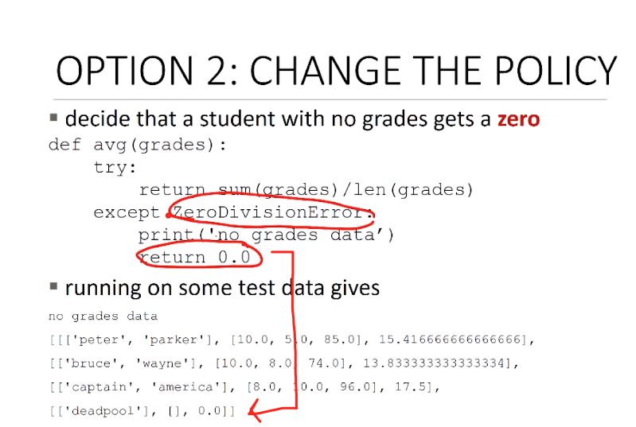

# Lec8_exceptions

* Common Exception in Python
  * `SyntaxError`
  * `NameError`
  * `AttributeError`
  * `TypeError`
  * `ValueError`
  * `IOEError`

## Exception handling in Python

```python
try:
  #do something
except XXXError:
  #do something if XXXerror happens
except:
  #do something if other error happens
  raise XXXError('error message') # <exception name> (<arguments>)
else:
  # enter if try without exceptions
finally:
  # do something after, regardless of the exception
```

## IO example



**Putting explicit `return` in `except` to avoid returning `None`** 



## Assertions

* Example of defensive programming

  ```python
  def avg(grades):
    assert not len(grades) == 0, 'no grades data'
    return sum(grades) / len(grades)
  ```

* Usually used to check func inputs / outputs

