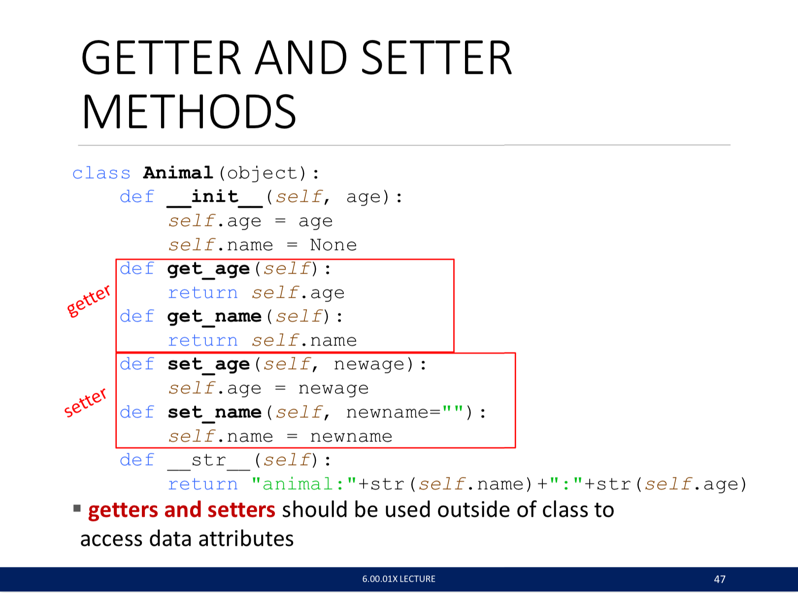

# Lec9_OOP

## Objects

* Everything in Python is an object
* Object
  * Type
  * Private internal representation (primitive or composite)
  * Procedures of interaction
  * might be an **interface**
* Create
* Destroy
  * `del(objectName)`
  * do nothing (let GC process it)
* Class vs Instance
  * Class - blueprint
  * Instance - Construction
* Advantage 
  * Reuse code
    * Interitance
  * Bundle data

## Define a class

```python
class ClassName (ParentClassObject): # mostly (object)
  
  #data attributes (i.e. variables in Java)
 	#1. define class variables (and the values) here
 
  #constructor: used to create instance
  def _init_(self, parameters..):
    #2. define instance variables (and the values) here
    self.p2 = p1
    self.p2 = p2
  #procedural attributes (i.e. methods in Java)
  def methodName (self, other_parameters..):
    #do something
    return values
  #print method
  def _str_(self):
    return "this is the print of the class"
#creating a class
instance1 = ClassName(parameters..)

#**use a method
instance1.methodName( other_parameters..)
ClassName.methodName(instance1, other_parameters..)

#**check instance
isinstance(instance1, ClassName)

#**special operators
'''
_add_(self, other)
_sub_
_eq_ -> ==
_lt_ -> less than
_len_
_str_
'''
```

### Example: the fraction class

## Summary





## Hierarchies

* Can define own `def _init_(self)`, or use superclass's


* Method finding: **<u>from self up to the hierarchy</u>** (siblings does not interract with each other)


